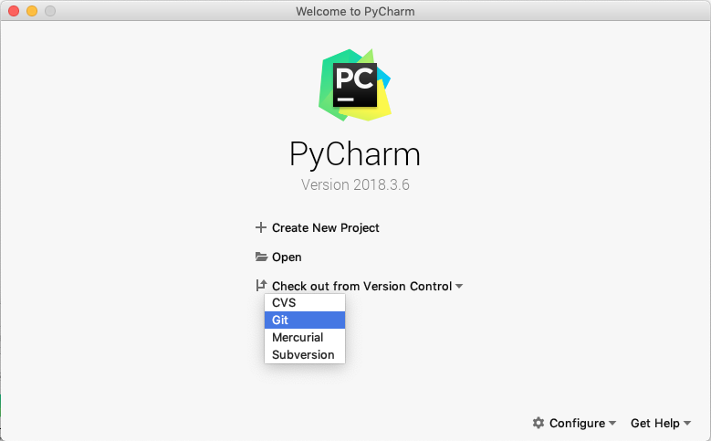
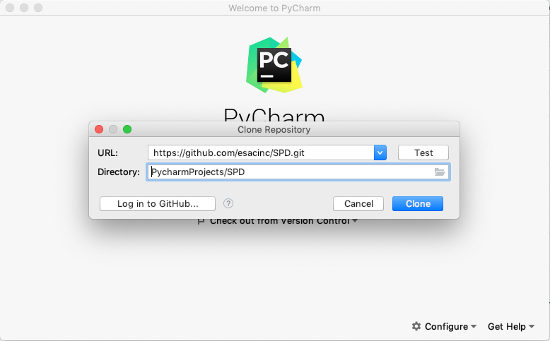
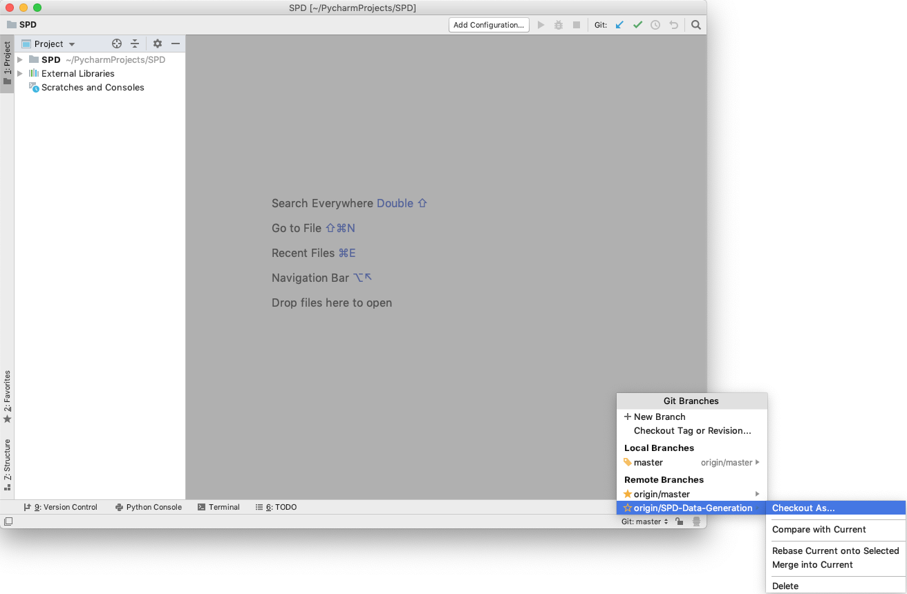
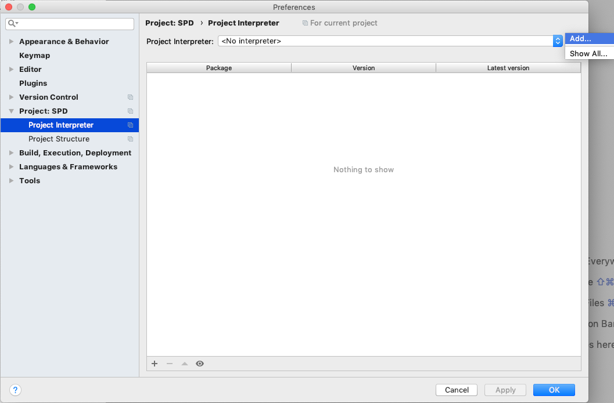
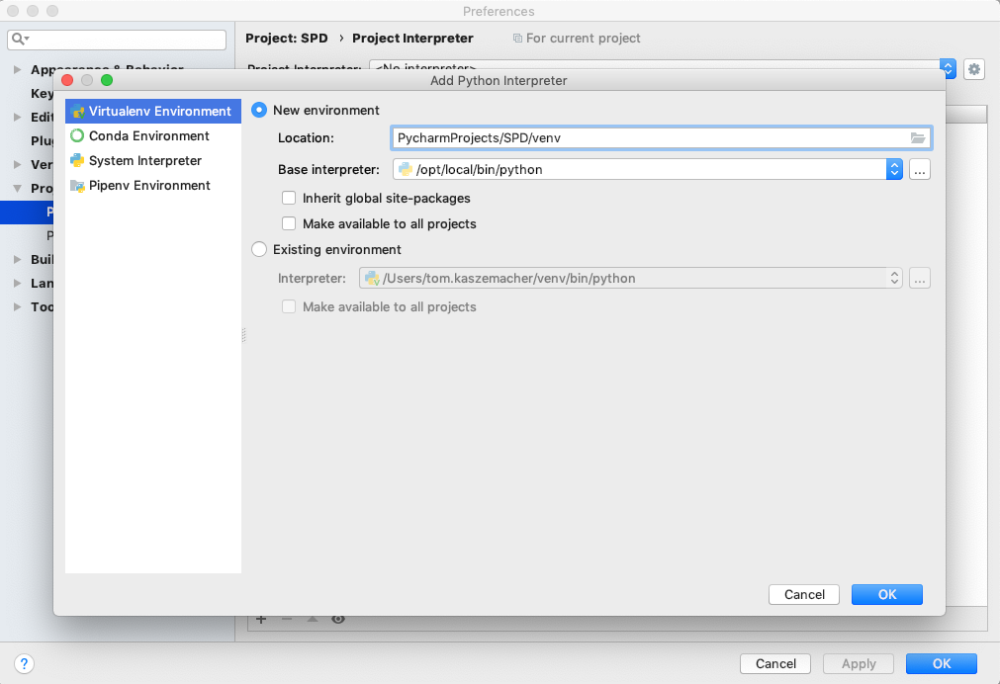
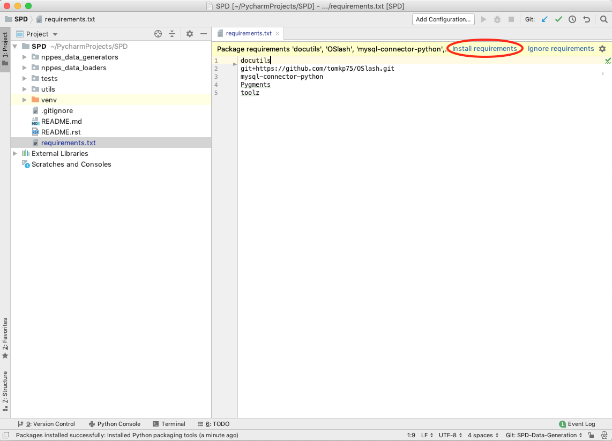
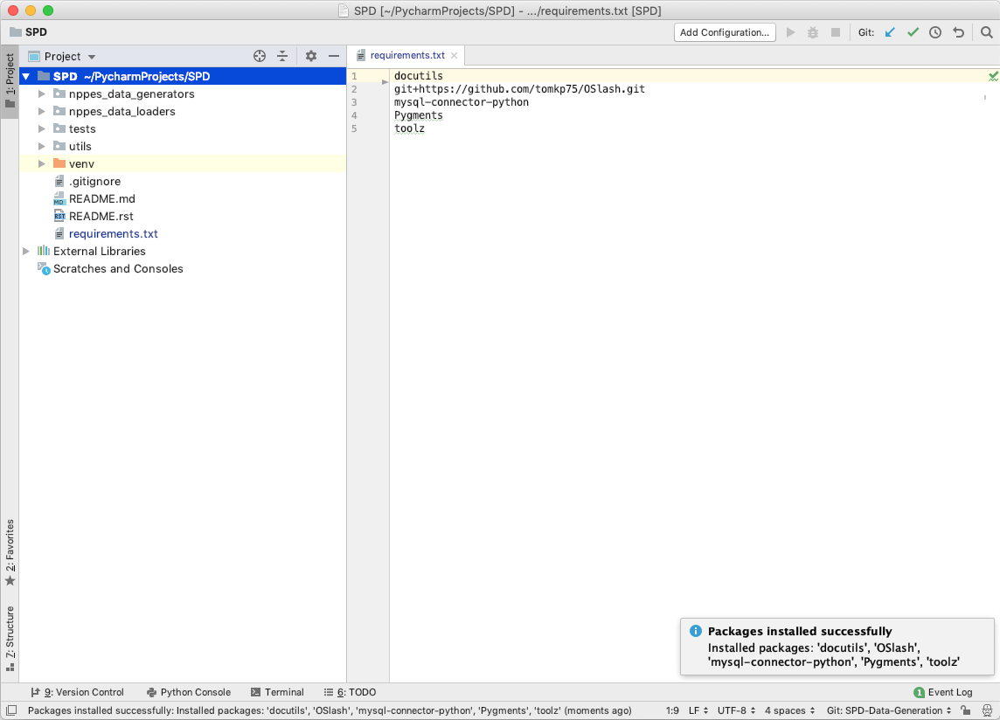

Using PyCharm - https://www.jetbrains.com/pycharm/download/
===========================================================

Download and launch PyCharm then:

1. Checkout from git

Confirm checkout clicking "Yes" on the next popup window.

2. Checkout the wanted branch if not master

3. To setup a project interpreter, open PyCharm Preferences and add a new project interpreter under
Project: SPD > Project Interpreter

4. Open requirements.txt at the root of the project and install all requirements

End